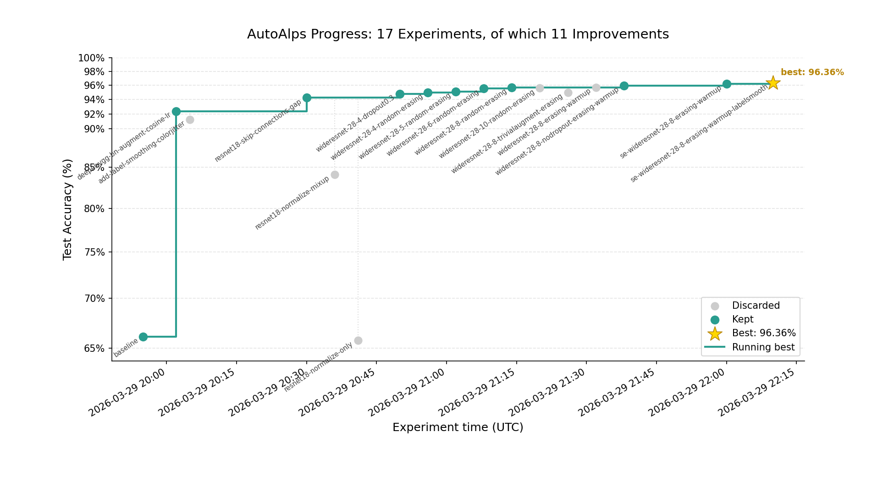

# AutoAlps

AutoAlps is an adaptation of Andrej Karpathy’s [autoresearch](https://github.com/karpathy/autoresearch) and it is meant to test a FirecREST MCP server.



## Overview

The goal of this project is to make a first trivial attempt at autonomous experimentation workflows that interact with HPC systems via FirecREST, using an MCP server as the integration layer.

Conceptually:

* **Autoresearch loop** → drives iterative experimentation
* **MCP server** → exposes system capabilities (FirecREST APIs)
* **Claude CLI** → orchestrates reasoning + tool usage

Claude makes code changes locally and uploads them to `clariden` what it submits the job. It then reads the job log file to determine the outcome and plan the next iteration.

## Setup

### 1. Install Claude CLI

Subscribe to Claude and install the CLI.

### 2. Create FirecREST credentials

On `https://developer.cscs.ch`:

* Create an application
* Subscribe to FirecREST
* Retrieve the OAuth **Consumer Key** and **Customer Secret**

### 3. Start the MCP server

Create a virtual environment with dependendices:

```sh
uv venv
source .venv/bin/activate
uv pip install -r requirements.txt
```

Add oauth key and secret to `.env`, then start the server:

```sh
uv run src/server.py
```

### 4. Register MCP server in Claude

Move into the project directory:

```sh
cd ./autoalps
```

Register the FirecREST MCP server:

```sh
claude mcp add firecrest http://localhost:8888/mcp --transport http
```

Via the `/mcp` command, confirm that it shows as "connected". To double-check, you can ask Claude to list systems you have access to.

### 5. Setup folders and .venv on Alps

On Alps, the virutal environment needs to be prepared.

```sh
[clariden][stefschu@clariden-ln001 autoalps]$ pwd
/iopsstor/scratch/cscs/stefschu/autoalps

[clariden][stefschu@clariden-ln001 autoalps]$ srun --pty --account csstaff --mpi=pmix --network=disable_rdzv_get --environment=$(pwd)/environment.toml bash

# once in the container, check to be on the intended folder 
uv venv --system-site-packages .env
uv add pydantic_settings

# exit the container
```

### 6. Start an autonomous session

Back on your computer, launch Claude and initialize the workflow:

```sh
# Suggested initial prompt
Have a look at CLAUDE.md and verify that the setup works.

# Start experimentation loop
Proceed to experiment autonomously. Keep iterating without asking for input.

# Resume if interrupted
Resume the autonomous experimentation. Keep iterating without asking for input.
```

### 7. Handle permissions

During early iterations, the agent will request various permissions.

Approve as appropriate. Git access may require explicit whitelisting on `./.claude/settings.local.json`, for example:

```json
"Bash(cd /Users/user/git/firecrest-mcp && git *)"
```

### 8. Plot results

Once several experiments concluded, visualize progress using:

```sh
progress.ipynb
```

### 9. Terminate loop

Through the usual double Ctrl+C the loop can be interrupted.

## Notes

* The system is intentionally **open-loop and exploratory**: expect unstable early iterations.
* FirecREST acts as a **remote execution substrate**, while Claude handles planning and control.
